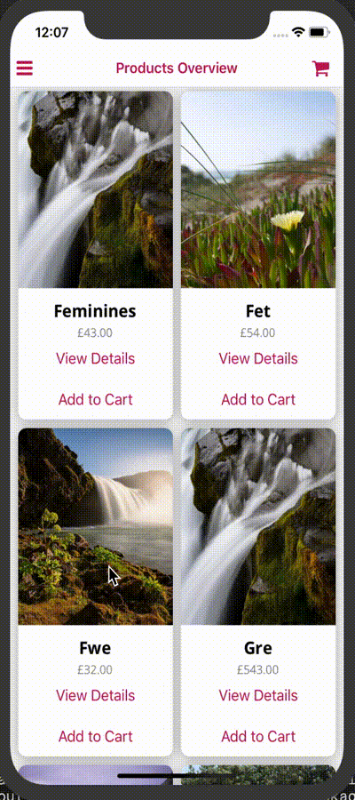

# ClotheSwap

> A fun and convenient way to update your wardrobe ...
>
>  ...whilst mitigating the damaging effects of fast fashion:
> - lower your carbon footprint
> - reduce the amount of clothes destined for landfill

<p align="center">

---

## Installation

#### Dependencies
- [iOS Simulator](https://docs.expo.io/workflow/ios-simulator/)
- [Android Studio Emulator](https://docs.expo.io/workflow/android-studio-emulator/)
- Install Expo Client from the App or Play Store onto your phone

#### Running it locally
install package dependencies
```shell
$ git clone https://github.com/MaxRobertsDear/ClotheSwap.git
$ cd clotheswap
$ yarn install
```
run on iOS Simulator
```shell
$ yarn ios
```
run on Android Studio Emulator
```shell
$ yarn android
```
run as Web App
```shell
$ yarn web
```

---

## Technologies (Highlights)
### Dependencies
- Expo Managed Workflow
- React Native
- React Navigation v5
- Redux
### Dev Dependencies
- Typescript
- React Native Testing Library
- Husky (pre-commit hooks)
- Prettier

